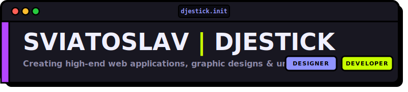
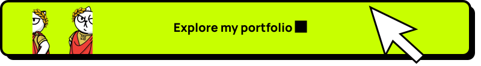
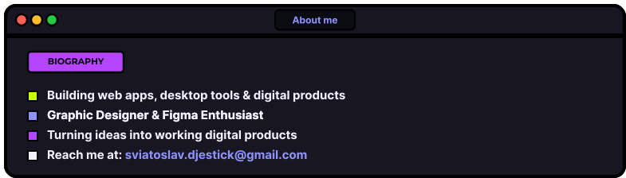
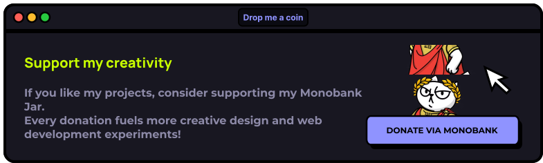

<!-- Profile Header Banner -->

  

<!-- Typing SVG -->

  

<!-- Neobrutalist Stats Badges -->

  
  
  

<!-- Clickable Portfolio Card -->

  

<!-- About Me Card -->

  

 

<h3 align="center" style="font-family: 'Montserrat', sans-serif; font-weight: 900; color: #F0F0FF;">🛠️ Tech Stack &amp; Tools</h3>

<!-- Neobrutalist-style Table Container for Skills -->

  <table border="4" cellpadding="15" cellspacing="0" style="border-collapse: collapse; border: 4px solid #000000; background-color: #181721; margin: 0 auto;">
    <tr>
      <td align="center">
        
      </td>
    </tr>
  </table>

 

 

<h3 align="center" style="font-family: 'Montserrat', sans-serif; font-weight: 900; color: #F0F0FF;">📊 Stats &amp; Activity</h3>

<!-- Stats Grid Container -->

  <table border="4" cellpadding="10" cellspacing="0" style="border-collapse: collapse; border: 4px solid #000000; background-color: #181721;">
    <tr>
      <!-- Top Languages Card -->
      <td align="center" style="border-right: 4px solid #000000;">
        
      </td>
      <!-- General Stats Card -->
      <td align="center">
        
      </td>
    </tr>
  </table>

 

<!-- Activity Graph -->

  <table border="4" cellpadding="10" cellspacing="0" style="border-collapse: collapse; border: 4px solid #000000; background-color: #181721; width: 800px;">
    <tr>
      <td align="center">
        
      </td>
    </tr>
  </table>

 

 

<!-- Support Monobank Jar -->

  

